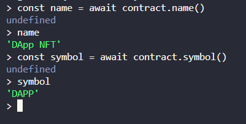

# NFT marketplace :

* Install hardhat which allows us to setup our test blockchain and test our contracts.

* Install react router : `npm i react-router-dom@6`.

* Install ipfs-http-client which is a decentralized file system : `npm i ipfs-http-client@56.0.1`.

* We install the ipfs-http-client so as to upload the content of the NFT to ipfs (which is a decentralized file system) before we mint it.

* Install open zeppelin contract library which is a library of secure and pre-built contracts that devs can import the contracts into their projects.

* We use open zeppelin contracts to import ERC-721 NFT standard.

* Install open zeppelin using : `npm i @openzeppelin/contracts@4.5.0`.

## Project :

* This project is a hardhat and react project combined into one.

* Hardhat allows us to write smart contracts, write tests against them and deploy them to a local blockchain.

* The `hardhat-config.js` contains the version of solidity we use to compiler the smart contract and also the path to files like smart contracts ,artifacts and tests.

* Our project has two parts the frontend and the backend.

* The backend is where we write our smart contracts, tests and deployment scripts which we can run to deploy smart contracts to our local blockchain.

* The frontend is the react app.

* We will be using bootstrap in the frontend.

## NFT Smart contract :

* The ERC721 standard defines a set of functions that a NFT contract should have at bare minimum. This standard was created so that all the dApps are compatible with it.

* And we import the URI storage smart contract.

* Two most important functions are which we will be using is :
    * transferFrom : This function allows us to transfer the ownership of the token to another address.

    * approve : gives permission to transfer tokenId token to another account. The approval is cleared when the token is transferred. So when we transfer NFT to the marketplace, owner will have to call this function.

## Deploying the NFT smart contract in test blockchain :

* Now we deploy our smart contract to a local blockchain which comes bundled with the hardhat framework.

* We run the local blockchain using the `npx hardhat node` command. 

* The local blockchain comes with the 20 test accounts.

* Whenever we run the deploy script and deploy our smart contract to the local blockchain a copy of the smart contract's address and abi is saved to the frontend which it can use to communicate with the smart contract.

* We add our deployment code in the deploy.js file and run the deploy script using the `npx hardhat run .\src\backend\scripts\deploy.js --network localhost` command.

* To interact with the blockchain or the smart contracts deployed to it we use `npx hardhat console --network localhost`. We also need to pass in the network.

* In the console we can get access to our contract by running in the console terminal `const contract = await ethers.getContractAt("NFT_NAME","NFT_ADDRESS")`.

* And if we console this contract object we can see all the functions and other metadata related to our contract. We can all different methods on the contract using the console.Example : `const tokenCount=await contract.tokenCount()`.

* 

## Marketplace smart contract :

* Interface define how a function is called on the contract without being aware of its implementation.

* In the marketplace contract we set the feeAccount to which the eth will be transfered to when something is bought from the marketplace. And we deploy that contract using the same process as we did for the NFT smart contract.

* The sender address is usually the 1st account of the 20 dummy accounts.

* Marketplace contract needs to keep track of each of the NFTs that are being sold.

* For that we use a Item struct and a items mapping which maps the itemId to the item struct.

* When we call makeItem function we transfer the nft from the sender address to the marketplace contract. And create a new mapping entry and emit an event.

## Testing our smart contracts :

* Each time we include a new functionality into our project we need to test it. We can do it using the hardhat console but thats extremely time consuming. So we use automated tests.

* Tests are more important becuase once a smart contract is deployed to the blockchain it is not possible to modify it and hence error are very costly. And hence we must robustly test our smart contracts.

* Hardhat allows us to write and test our code. All our tests are in the `test` in backend folder.

* We will be writing the tests in js using the waffle testing framework provided to us by hardhat. And in addition to waffle we will also be using chai to assert our tests.

* To run the tests we write in the test folder we run : `npx hardhat test`.

## Frontend :

* We import ether.js library to our App.js file and this will allow us to talk to ethereum nodes. And we have already used it to connect to our local blockchain.

* Ethers is going to connect to metamask and metamask is already connected to blockchain. Basically ethereum is going to connect to web 3 provides which is what metamask uses to connect to websites.

